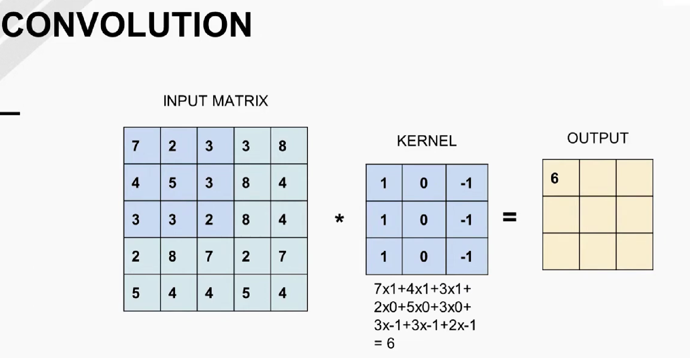

# Convolution neural Network
Neural Networks c,onsists of a series of connected Artificial neurons. Connections b/w neurons are directed, and signal from one neuron to another only travels in a specified direction. The basic architecture of a neural network contains an input layer, few hidden layers and an output layer.

The term feed forward neural network is used to describe neural networks where the output from one layer is used as an input to the next layer. There are no such cycles or loops in the graphuical structure of Neural Network. We also know that a neural network with one or maore layer, is called multi-layer perceptron. However, the mLP suffers from one large drawback, espacially when working with image data.

A single 256x256 RGB image contains 196,608 input features. If we were to connect each of these input features to a hidden layer containing 1,000 neurons, we would have 196,608,000 connections. To create a multi-layer perceptron with that large input requires a lot of memory and computational power. This is where convolution neural network comes into play.

Convolution Neural Network (CNN) like MLP conssts of a stack of layers that take in an input image. These layers performs a series of mathematical operations which are usually linear transformations with non-linear activations. They preduict the label probabilities at output. 

Unlike an MLP, the neurons in CNN layer are not connected to all the neurons in the previous layer. Instead, each neuron in CNN is connected only to a small region of the layer before it, and are applied to whole input layer in a sliding window fashion. This arrangement allows the CNN to have fewer parameters, and thus be more efficient to train than an equivalent MLP. Another difference, is convolutions are applied to 2D data, so each neuiron oberves a meaningful spatial neighborhood.

Convolution is a powerful concept, forms basis of many Linear filters. There are three main operations in the Convolution operation:
1. Input Matrix
2. Kernal or Filter
3. Output Matrix
4. Classification (Fully Connected Layer) - For Convoolution Neural Network

## Convolution
Convolution is the first layer to extract features from an input image. Convolution preserves the spatial relationship between pixels by learning image features using small squares of input data. It is a mathematical operation that takes two inputs such as image matrix and a filter or kernel. The filter is smaller than the input image. It slides over the input image, performing element wise multiplication of the filter and the input and then summing them up. This result is a single value in the output image called the activation map or feature map. The filter is then slid over all the locations, performing the same operation and creating the output image. The output image is smaller than the input image because of the reduction caused by sliding the filter over. 

Imagine having a 3D matrix (matrix with a depth or an RGB image), or a tensor. To perform the convolution operation, the kernal must also possess the same depth, however, the output dimension dosent need to change. The size of the output image is controlled by three parameters:
1. Depth: Depth corresponds to the number of filters we use for the convolution operation. Each filter produces one feature map in the output image.
2. Stride: Stride is the number of pixels by which we slide our filter matrix over the input matrix. When the stride is 1 then we move the filters one pixel at a time. When the stride is 2 then we move the filters 2 pixels at a time and so on. Having a larger stride will produce smaller output image.
3. Zero Padding: Sometimes filter does not fit perfectly fit the input image. We can add zero pixels to the border of the input image so that the filter fits. The number of pixels that we add is the zero padding.

<video src="WhatsApp%20Video%202023-10-09%20at%203.01.30%20PM.mp4" controls title="Title"></video>

The values at kernel represents an important apect of the output image. The values in the kernel are called weights. The weights determine what features the convolution layer will detect. The way kernel values or filter is designed, there is a possibility to detect low level features of an input imagage, such as blurr, shortneing of edges, edge detection, etc. 

## Layers in CNN
There are different types of layers, that constitutes a modern CNN. The layers are:
### Classification (Fully Connected Layer)
The fully connected layer is a traditional multi-layer perceptron (MLP) that uses a softmax activation function in the output layer. The term "Fully Connected" implies that every neuron in the previous layer is connected to every neuron on the next layer. The output from the convolutional and pooling layers represent high-level features of the input image. The purpose of the Fully Connected layer is to use these features for classifying the input image into various classes based on the training dataset. It is in the fully connected layer where most of the parameters in our model are located. The output of the fully connected layer is a vector that represents the probability scores of each class.

### Activation Layer (ReLU - Default)
ReLU stands for Rectified Linear Unit for a non-linear operation. The output is 0 if the input is less than 0, otherwise the output is equal to the input. It is an element wise operation. ReLU is the most commonly used activation function in CNNs. ReLU is used to add non-linearity to the system. 

### Convolution Layer
We know an input of MLP is a 1D tensor, and we need to flatten it before we use this as an input to MLP. The CNN architecture operated on 2D data. The input to convolution operation is a 3D image consists of Width x Height x Channels (W x H x C), where W & H are called spatial resolutions, and C is refered to as depth. The matrices that store such complex information are called, feature maps. So the input and output of a convolution operation is a feature map. As mentioned above, the convolution layer consists of several filters, and filter spatial resolution is called the kernal size. They are ususlly small, for example 3x3 or 5x5, with a same depth as of input image (or matrix). One filter produces one channel of an output feature map, which means the no of channels in an output feature map is equal to the no of filters used in the convolution layer. The output feature map is smaller than the input image because of the reduction caused by sliding the filter over. Upuntill now, my uinderstanding is that, the movement of a filter over an input image is done single filter location at a time, hoever, in general we can move it by different amount called stride. to preserve the border information of an input image, a padding of zeros is added to the border of an input image. 

### Pooling or Sub-Sampling
Pooling is a down sampling operation that reduces the dimensionality of the feature map. In other words, to avoid the discripiency in a featuremap, downsampling an input image will retain all the features of an input image, though the resolution will be lowbut it highlights the structural elements and supress the non-important elements of an input image. It reduces the computational cost by reducing the number of parameters to learn and provides basic translation invariance to the internal representation. Pooling layer operates on each feature map independently. The most common approach used in pooling is max pooling. Max pooling takes the largest element from the each rectified patch of feature map. Taking the largest element could also take the average pooling. Max pooling is the most common approach used in CNNs. Max pooling is used to add non-linearity to the system. Beside, there exist another pooling technique called average pooling. Average pooling takes the average of all the elements in each patch of the feature map.

### Batch Normalization Layer
Batch normalization is a technique for training very deep neural networks that standardizes the inputs to a layer for each mini-batch. A batch is a small set of images or data, that is fed to the neural network in one step of gradient calculations during the training process. It applies the popular data science notion of zero mean and unit variance to deep learning. This has the effect of stabilizing the learning process and dramatically reducing the number of training epochs required to train deep networks. Batch normalization is used to normalize the input layer by adjusting and scaling the activations. Batch normalization reduces the amount by what the hidden unit values shift around (covariance shift). In other words, batch normalization allows each layer of a network to learn by itself a little bit more independently of other layers. It is used to make the network more stable and to reduce the number of training epochs needed to train the network. The benifits of batch normalization are:
1. Networks train faster - Faster convergence b/c it uses higher learning rates and is less sensitive to the initialization.
2. Mitigates the vanishing gradient problem - BN normalizes activations, and prevents them from shifting too much, which solves the problem of vanishing gradients.
3. Improves stability 
4. Better regularization - BN reduces the need for dropout and other regularization techniques.
In practice, BN comes after a convolution or fully connected layer, and actiation layer.

There have been several works that applied CNNs to image recognition. For example LENET5, developed in 1998. 

This CNN used 2 convolution and corrosponding 2 pooling layer sets, a flattening layer and 2 fully connected layers followed by a softmax classifier.