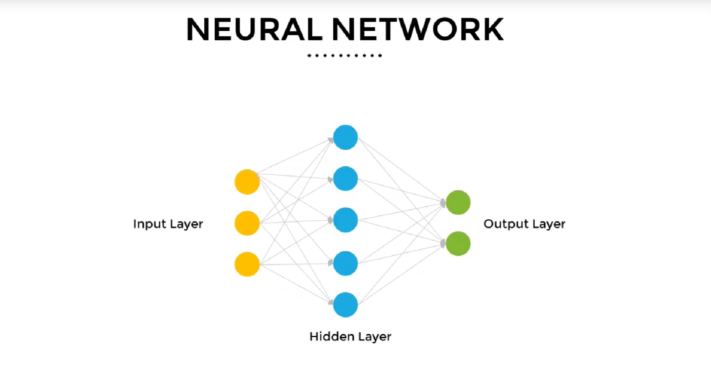

# Convolution neural Network
Neural Networks c,onsists of a series of connected Artificial neurons. Connections b/w neurons are directed, and signal from one neuron to another only travels in a specified direction. The basic architecture of a neural network contains an input layer, few hidden layers and an output layer.

