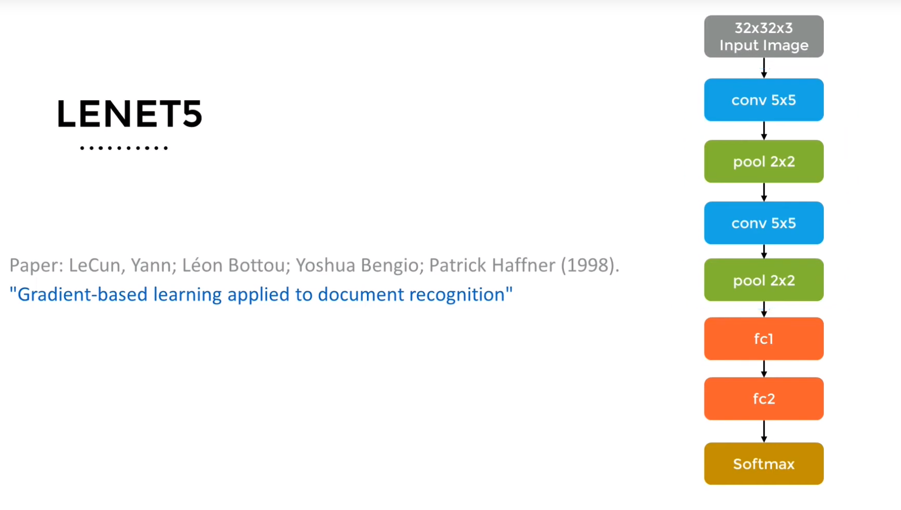

# Convolution neural Network
Neural Networks c,onsists of a series of connected Artificial neurons. Connections b/w neurons are directed, and signal from one neuron to another only travels in a specified direction. The basic architecture of a neural network contains an input layer, few hidden layers and an output layer.

The term feed forward neural network is used to describe neural networks where the output from one layer is used as an input to the next layer. There are no such cycles or loops in the graphuical structure of Neural Network. We also know that a neural network with one or maore layer, is called multi-layer perceptron. However, the mLP suffers from one large drawback, espacially when working with image data.

A single 256x256 RGB image contains 196,608 input features. If we were to connect each of these input features to a hidden layer containing 1,000 neurons, we would have 196,608,000 connections. To create a multi-layer perceptron with that large input requires a lot of memory and computational power. This is where convolution neural network comes into play.

Convolution Neural Network (CNN) like MLP conssts of a stack of layers that take in an input image. These layers performs a series of mathematical operations which are usually linear transformations with non-linear activations. They preduict the label probabilities at output. 

Unlike an MLP, the neurons in CNN layer are not connected to all the neurons in the previous layer. Instead, each neuron in CNN is connected only to a small region of the layer before it, and are applied to whole input layer in a sliding window fashion. This arrangement allows the CNN to have fewer parameters, and thus be more efficient to train than an equivalent MLP. Another difference, is convolutions are applied to 2D data, so each neuiron oberves a meaningful spatial neighborhood.

There are four main operations in the Convolution Neural Network:
1. Convolution
2. Non-Linearity (ReLU)
3. Pooling or Sub-Sampling
4. Classification (Fully Connected Layer)

## Convolution
Convolution is the first layer to extract features from an input image. Convolution preserves the spatial relationship between pixels by learning image features using small squares of input data. It is a mathematical operation that takes two inputs such as image matrix and a filter or kernel. The filter is smaller than the input image. It slides over the input image, performing element wise multiplication of the filter and the input and then summing them up. This result is a single value in the output image called the activation map or feature map. The filter is then slid over all the locations, performing the same operation and creating the output image. The output image is smaller than the input image because of the reduction caused by sliding the filter over. The size of the output image is controlled by three parameters:
1. Depth: Depth corresponds to the number of filters we use for the convolution operation. Each filter produces one feature map in the output image.
2. Stride: Stride is the number of pixels by which we slide our filter matrix over the input matrix. When the stride is 1 then we move the filters one pixel at a time. When the stride is 2 then we move the filters 2 pixels at a time and so on. Having a larger stride will produce smaller output image.
3. Zero Padding: Sometimes filter does not fit perfectly fit the input image. We can add zero pixels to the border of the input image so that the filter fits. The number of pixels that we add is the zero padding.
4. Filter Size: Filter size is the dimension of the filter matrix. If the size is 3x3 then we have a 3x3 filter matrix. Common filter sizes are 3x3, 5x5, 7x7. The larger the filter size, the more information we consider in our neighborhood.
5. Output Depth: Output depth corresponds to the number of filters we use for the convolution operation. Each filter produces one feature map in the output image.
6. Input Image Size: Input image size corresponds to the size of the input image. For example, an RGB image of 6x6x3 will have a width of 6, a height of 6 and depth of 3. The depth is 3 because we have three channels for RGB.
7. Output Image Size: Output image size corresponds to the size of the output image. For example, an RGB image of 6x6x3 will have a width of 6, a height of 6 and depth of 3. The depth is 3 because we have three channels for RGB.

## Non-Linearity (ReLU)
ReLU stands for Rectified Linear Unit for a non-linear operation. The output is 0 if the input is less than 0, otherwise the output is equal to the input. It is an element wise operation. ReLU is the most commonly used activation function in CNNs. ReLU is used to add non-linearity to the system. 

## Pooling or Sub-Sampling
Pooling is a down sampling operation that reduces the dimensionality of the feature map. It reduces the computational cost by reducing the number of parameters to learn and provides basic translation invariance to the internal representation. Pooling layer operates on each feature map independently. The most common approach used in pooling is max pooling. Max pooling takes the largest element from the rectified feature map. Taking the largest element could also take the average pooling. Max pooling is the most common approach used in CNNs. Max pooling is used to add non-linearity to the system.

## Classification (Fully Connected Layer)
The fully connected layer is a traditional multi-layer perceptron that uses a softmax activation function in the output layer. The term "Fully Connected" implies that every neuron in the previous layer is connected to every neuron on the next layer. The output from the convolutional and pooling layers represent high-level features of the input image. The purpose of the Fully Connected layer is to use these features for classifying the input image into various classes based on the training dataset. It is in the fully connected layer where most of the parameters in our model are located. The output of the fully connected layer is a vector that represents the probability scores of each class.

## CNN Architecture
The CNN architecture consists of an input and an output layer, as well as multiple hidden layers. The hidden layers of a CNN typically consist of convolutional layers, pooling layers, fully connected layers and normalization layers.

There have been several works that applied CNNs to image recognition. For example LENET5, developed in 1998. 

This CNN used 2 convolution and corrosponding 2 pooling layer sets, a flattening layer and 2 fully connected layers followed by a softmax classifier.